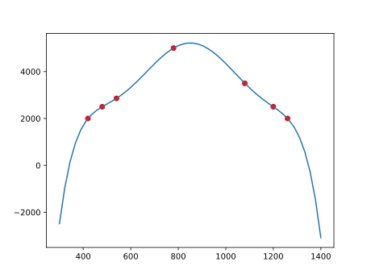
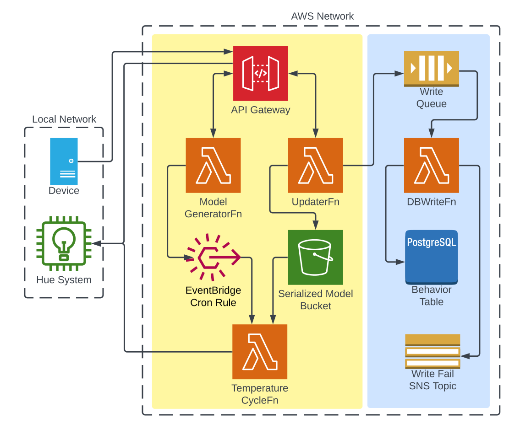

# Circadian Rhythm in The Cloud
## What is this?
This project is an experiment in whether AWS would be a good method by which to control the lights in my office
to help with sleep schedule and other things like seasonal depression. This project is meant to be deployed on AWS
and is designed as a serverless application (other than an optional data collection pipeline). Lambda functions are 
cheap to run so this makes it viable but latency is a potential problem over the span of a day (you'll see a 
cost and latency analysis below). The lambda functions are Python (with Docker) and the infrastructure is written using AWS CDK V2 for
TypeScript.

## How to deploy
This is a standalone app and can be deployed using normal CDK commands:

in `cdk.json` the following context variables are set:

| Key               | Function                                                                          |
|-------------------|-----------------------------------------------------------------------------------|
| `hueAddress`      | Address of the Bridge to forward control requests                                 |
| `hueApiKey`       | Authentication key distributed by the Bridge                                      |
| `lightGroup`      | Identifier representing a group of lights recognized by the bridge                |
| `lambdaFunctions` | Object contraining functions to deploy with optional function for data collection |

Including `dbWriteFn` in the `lambdaFunction` object sets a flag in the main stack to deploy the data collection
function and associated components.

## How temperature values are calculated
Considering the spin of the world traces a circle, we can likely expect that the sun relative to us
moves in a sinusoidal fashion.
From this, we can expect that the greatest slope (change in sun's level) at the start and end of the day.
I don't want to exactly mimic this because maybe I'd like to wake up a bit more rapidly than the sun allows,
or have a slightly longer day with a more rapid sundown than the current season would allow. 
I'd like to get somewhat close though.
To achieve this I use a quadratic interpolation with a set of values representing time (minutes elapsed in the day) 
and temperature (in Kelvin). (Polynomial interpolations are cheap and relatively effective, so it's a good choice here)

Using some values that I'd like my day to be based on:
```
minute_x = [420,  480,  540,  780,  1080, 1200, 1260]
temp_k_y = [2000, 2500, 2857, 5000, 3500, 2500, 2000]
```
`numpy.polynomial.Polynomial.fit(minute_x, temp_k_y, deg=6)` gives us a pretty nice curve:


X is the time of day and Y is light temperature. A higher temperature light represents more blue light
which generally correlates with the position of the sun. 

Red here represent points of the input. We can see that the curve is pretty smooth and with little error 
(in fact, R^2 = .9940032 so other inputs of a similar shape will do fine). A degree 6 here may seem a little like overkill, but it's the lowest degree where the outlier 
value will still be hit. This is important as we want daytime light during the daytime.

## Architecture
In order to make this work the following happens:



### <span style="color:#f2f791">Core functionality</span>
The yellow region defines core functionality with the following functions:

API Gateway routes request to the functions. Depending on the request the associated function handles
the action.

#### ModelGeneratorFn 
Uses Numpy to generate a model that we can call as a functions. 
This model gets serialized and put into an S3 bucket. The function also updates an environment variable of
TemperatureCycleFn to the new object's name. 
This function can also be called using API Gateway to generate a new model with new values located in the payload.

Because Numpy is not available in the Lambda instance by default, this function is deployed containerized w/ Numpy.

#### UpdaterFn 
Receives API requests to turn the lights on and off.
When the lights get turned off, the cron rule gets disabled to avoid needlessly instantiating.
When the lights are turned on again, the cron rule is re-enabled.
The function also writes the time and action performed to a Postgre table,
this will later be used to train a model.

#### TemperatureCycleFn 
is invoked every minute by an EventBridge cron rule.
It gets the model object from the bucket, generates the new temperature,
and sends a PUT request to the light bulbs on my local network using an API key saved in an SSM Parameter. 
The request here doesn't matter so the request is invoked on a separate thread and allows us to exit the function before a return is received.
TODO: implement error handling and notification


### <span style="color:#91baf7">Auxiliary data pipeline</span>
Blue represent an optional data pipeline

The UpdaterFn sends a message containing action and time to an SQS queue. A DB writer function will parse the message and 
insert into a table on a Postgres RDS instance. The function is invoked by SQS and will pull all available messages from the queue.
If the function fails to write messages the message will remain in the queue.
If messages older than an hour are read, an SNS notification will be sent out.

For Python to communicate with the DB psycopg is needed, to the function is deployed containerized to install the dependencies.

This also deploys a VPC with private and public subnets. The DB instance lives in the private subnet
and can be communicated with via a NAT inside the public subnet.

## Cost and Timing Analysis
This was written recently and I have yet to test.

### Shortcomings
- There are several functional shortcomings such as where I'm communicating from. I designed this mainly for my 
home office but can only talk to the system from there, simple fix should address this. 
- Need to implement error handling
- The current address is the one AWS provides, should integrate my own
